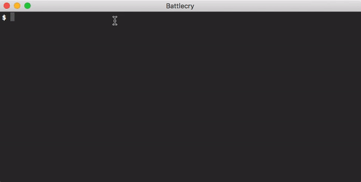

# 🥁 samba

> A simple and customizable scaffolding tool for all languages and frameworks

[](https://www.npmjs.org/package/samba)
[](https://travis-ci.org/pedsmoreira/samba)
[](https://github.com/prettier/prettier)
[](https://codeclimate.com/github/pedsmoreira/samba/maintainability)

<!-- [](https://codeclimate.com/github/pedsmoreira/samba/test_coverage) -->

<p align="center">
  
</p>

## Why Samba?

* ✅ Perfect for creating new modules, components and even new projects
* ✅ Use it with all languages and frameworks
* ✅ Plug'n play customizable generators
* ✅ Simple & Powerful API

## Examples

Each example can be downloaded with `sb download generator examples/example_name_here`.

1.  [args](./examples/args): Working with arguments
2.  [options](./examples/options): Working with options
3.  [multiple-templates](./examples/multiple-files): Working with multiple template files
4.  [aliases](./examples/aliases): Creating your own method aliases
5.  [helpers](./examples/helpers): Using helpers to share methods across generators
6.  [call-other-generators](./examples/call-other-generators): Using one generator to call multiple generators in a clean fashion
7.  [exec](./examples/exec): Executing a command line
8.  [load](./examples/load): Loading generators from a folder other than `samba/`

Advanced examples

9.  [WIP] - [advanced-crud](./examples/advanced-crud): Make magical CRUDs

# Getting Started

## Requirements

* [NodeJS](https://nodejs.org/en/) installed

🎩 If your project does not use NodeJS don't worry! Samba's API is very simple and you'll only need NodeJS installed to run the commands, no need to change your project setup.

## Install

```sh
npm install -g samba
```

## Command structure

Samba has a very simple structure.

`sb <method> <generator> arguments --options`

Samba can be used through both `samba` and it's short verion `sb`.

## Initialize Samba on you project

With Samba installed, go to your project folder and run:

```bash
sb g init
```

This will perform four actions:

* Create a `samba` folder on the root of your project
* Add a `samba/samba-setup.js` that you can use to add special configurations
* Create a generator called `component`
* Play the just created `component` with the arg `test-abc`

You should now be able to see a file called `it-worked/components/test-abc.txt`. This file was created using the generator at `samba/generators/component.generator.js` folder.

_Note_: Samba uses ES6 with lots of polyfill, so most things should ✨ _just work_ ✨ on your generator class.

## Help

If you need to check how your methods are registered, you can do so with:

```bash
sb --help
```

## Casex naming

This project uses [Casex](https://github.com/pedsmoreira/casex), an open source library designed to be an `All in one function for transforming word casings`. You may see many functions that can optinally receive `name?: string`. This means that all occurrences of the `__name__` pattern will be substituted using `casex` if the `name` parameter is provided.

Here are a few examples of how it works, considering you're using the name `John Doe`:

* `__name__`: johndoe
* `__naMe__`: johnDoe
* `__NaMe__`: JohnDoe
* `__na-me__`: john-doe
* `__na me__`: john doe

## Creating your own generators

```bash
sb g generator your_generator_name_here
```

This command will create a `samba/generators/your_generator_name_here`

# Generator API

## Configuring your methods

Each generator must have a `config` variable defining all samba methods.

```js
config = {
  options?: {
    [name: string]: {
      description: string,
      arg?: 'required' | 'optional', // An option may receive an argument
      alias?: string // Defaults to the first letter of the option name
    }
  },
  args?: string, // name ...surnames?
  description?: string
}
```

## File helpers

* `files(pattern: string, name?: string): File[]`: Get files that match `pattern`
* `file(pattern: string, name?: string): File`: Get first file that matches `pattern`
* `delete(path: string): void`: Delete a file or directory

- `templates(pattern?: string): File[]`: Get files inside the generator's `templates/` subdirectory
- `template(pattern: string): File`: Get first file that matches the pattern

As you may have noticed, most of these methods return one or an array of File(s). For more details about the `File` class API, please check the [File API](#File API) section below.

_Note: Samba performs all IO operations are performed synchronously_

## Helpers to call other generators

There may be cases when you may want to call multiple generators from one generators. Samba provides nice helpers for you to accomplish that in you `Generator` class.

* `generator(name: string): Generator`: Get a new generator instance by name
* `setArgs(args: Object): this`: Setup generator arguments to be consumed when `play` is called
* `setOptions(options: Object): this`: Setup generator options to be consumed when `play` is called
* `play(methodName: string)`: Play a generator method

## Executing command line directly

In some cases you may wanna call command lines directly.

* `exec(command: string): string | Buffer`: Execute command line

# File API

Both text files and binaries (such as images) are supported out of the box.

## Creating a new File instance

In most cases you'll use the file helpers on the generator. But if you need to create it manually:

* `constructor(path: string, name?: string)`

## Cool shortcuts

* `get binary(): boolean`: Check if it's a binary or text file
* `get exists(): boolean`: Check if the file exists
* `get filename(): string`: Get file name
* `get dirname(): string`: Get file directory path
* `get extension(): string`: Get file extension

## Persistence

* `save(): void`: Save file changes on it's current path
* `saveAs(path: string, name?: string): File`: Save file on a different path
* `delete(): void`: Delete file

## Text helpers

Lot's of `text` helpers receive `search: number | string`. This means that if a number is provided it assumes it as being a line number, otherwise it wil search for a line with the given string or throw an error.

* `get text(): string`: Get content as text
* `set text(text: string): void`: Set content as string (Eg. `file.text = 'abc'`)

- `get lines(): string[]`: Return file text split by line
- `set lines(lines: string[]): void`: Set file text from an array of lines (Eg. `file.lines = ['a', 'b', 'c']`)

* `replaceText(search: string | RegExp, replace: string, name?: string): this`: Replace one text ocurrence
* `replaceAllText(search: string, replace: string, name?: string): this`: Replace all text occurrences

- `search(search: string | number): number`: Get line number of the first line including `search`
- `last(search: string | number): number`: Like `search`, but starting from the last line

* `before(search: string | number, text: string, name?: string): this`: Add text before given line
* `beforeLast(search: string | number, text: string, name?: string): this`: Like `before`, but using `last`

- `after(search: number | string, text: string, name?: string): this`: Add text after given line
- `afterLast(search: number | string, text: string, name?: string): this`: Like `after`, but using `last`

* `prepend(text: string, name?: string): this`: Add text at the beginning of the file
* `append(text: string, name?: string): this`: Add text at the end of the file

- `replace(search: string | number, text: string, name?: string): this`: Replace line with a given text
- `replaceLast(search: string | number, text: string, name?: string): this`: Like `replace`, but using `last`

* `remove(search: string | number): this`: Remove line (`search` method is called to resolve line number)
* `removeLast(search: string | number): this`: Like `remove`, but using `last`

_Note_: If you attempt to use any text helper in a binary file (such as an image), samba will throw an error.

# Miscellaneous

## Sharing helpers across generators

It's not uncommon to have multiple generators share similar helpers. To facilitate you doing that, you can include files from your samba directory directly, without navigating with `..`.

If you have a `testHelper.js` file under `samba/helpers/testHelper.js` for instance, you could include it as:

```javascript
import testHelper from 'helpers/testHelper';
```

## Downloading generators

You may not have to write all your generators yourself. Samba comes with a handy tool for downloading generators from GitHub.

```
sb download generator owner/path
```

If you want to a service provider other then GitHub, please check the [download-git-repo examples](https://github.com/flipxfx/download-git-repo#examples)

### Selecting directory to download from

Samba looks for a `samba/` folder in the repository root. If none is found it defaults to the repository root. You may also set a custom directory to start Samba's search with `--dir`.

```
sb download generator owner/path --dir test-samba
```

## Customizing your samba-setup.js

### Loading generators from other folders

```js
export default function setup(samba) {
  samba.load('node_modules/samba-generatores-from-node-modules');
}
```

### Adding new aliases

By default Samba comes with two aliases: `g: generate` and `d: destroy`. You can both override these aliases and/or create new ones.

```js
export default function setup(samba) {
  samba.aliases.s = 'strike';
  // You can now use `sb s component` and it will be translated to `sb strike component`
}
```

# Resources

* [Contributing Guide](./CONTRIBUTING.md)
* [Code of Conduct](./CODE_OF_CONDUCT.md)
